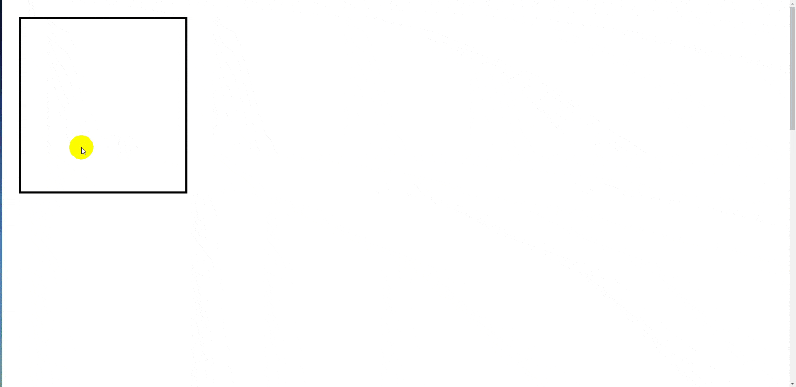

# livecut

> 轻量的网页切图设计稿对比工具

### 效果展示




### 引入方法

```javascript
<script src="./index.js"></script>
<script>
    // 第一个参数：图片对象 | URL网址
    // 第二个参数：可选，object{w:切稿宽度,h:切稿高度}

    // 使用图片对比
    let img = new Image();
    img.src = './cut.png';
    new LiveCut('./cut.png');

    // 获取网址的大小，打开目标网址控制台，输入：`{w:document.body.scrollWidth,h:document.body.scrollHeight}`，复制结果填入
    // 使用网址最对比
    new LiveCut('https://bing.com/', {w: 1920, h: 1000});
</script>
```
